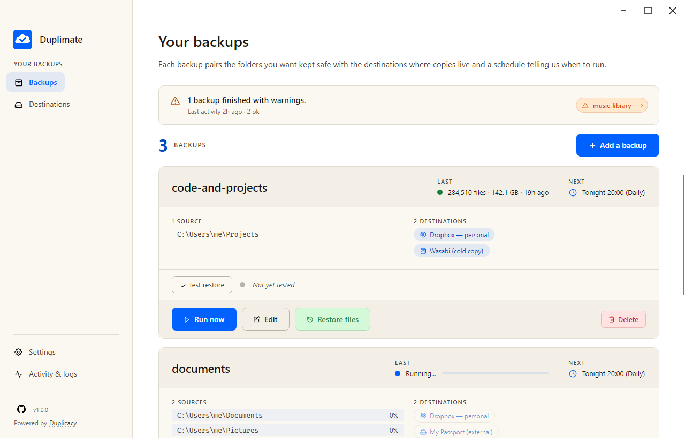
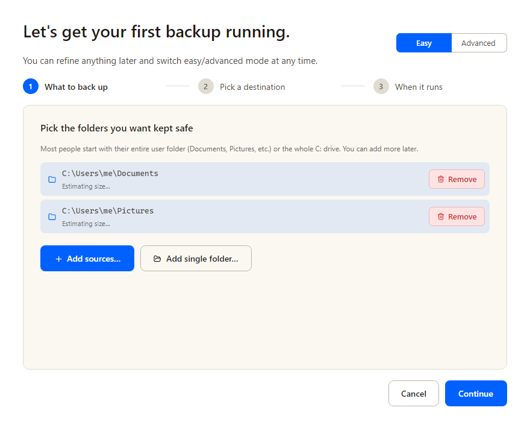
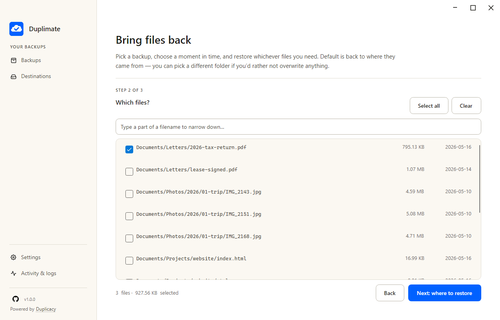

# Duplimate — Duplicacy Backups Made Easy

A friendly desktop GUI for [Duplicacy](https://duplicacy.com/). The whole
philosophy: **setting up a backup is three steps, restoring a file is three
steps.** If you can count to three, you can use Duplimate.

Pick the folders you care about, pick where the backups should live (local
folder, external drive, SMB share, Dropbox, OneDrive, Google Drive, or any
S3-compatible storage), set a schedule, and forget about it. One `.exe`, one
config folder, zero shell scripting.

Encrypted, deduplicated, fully under your control. Powered by the rock-solid
Duplicacy CLI.

> ⚠️ **No warranty. Backup software is "AS IS".** Duplimate may fail to
> run, miss schedules, or fail to restore. The authors are not liable for any
> data loss, business interruption, or other damage. **You are responsible
> for verifying your backups, periodically testing restores, and keeping
> redundant copies of important data** (the 3-2-1 rule: three copies, two
> media, one offsite). See [LICENSE](LICENSE) for the full terms — by using
> the software you accept them.

## Status

Duplimate is functional and covers the everyday backup loop end-to-end —
configure, schedule, monitor, restore. It hasn't accumulated enough real-world
mileage to call itself stable yet; broader use will surface the rough edges
that one developer's machine never hits. Help us shake those out by trying it
and reporting anything that surprises you.

- **Tested on Windows 11.** The full feature set works on the author's
  setup and against the standard cloud providers. It may well run on
  Windows 10 too — no one has tried.
- **No testing on macOS or Linux yet.** The code targets both via Avalonia
  and there's no architectural reason it shouldn't run — but no one has
  actually launched it there. If you do, please file an issue with what
  you saw.
- Issues, PRs, and field reports are very welcome.

The original author is now focusing on a successor project,
[**Backspace**](https://github.com/backspace-backup/backspace), an Avalonia desktop
GUI built around [Restic](https://restic.net) instead of Duplicacy.
Duplimate is not deprecated — Duplicacy is still an excellent engine
and Duplimate is a perfectly serviceable way to use it. If you'd like
to take Duplimate forward as a maintainer, open an issue.

## Screenshots

See the [project website](https://duplimate.github.io/) for the
full visual tour. A few highlights:

### Watch a backup run



Every backup at a glance. Status, last run, next run, source, destination —
and a live progress bar while one is running.

### Set up your first backup in three steps



Pick a folder, pick a destination, pick a schedule. The wizard walks
first-time users from cold install to first backup in under a minute.

### Restore exactly what you need



Browse a snapshot, tick the files you want back, choose where they go.
Parallel downloads with per-file retry — one slow file doesn't block the
rest.

## What it does

- **Destinations**: local folder, external drive (with volume-name matching —
  backups skip gracefully when the drive isn't plugged in, not fail), SMB /
  network share, Dropbox (app-scoped), OneDrive (personal + Business),
  Google Drive, S3-compatible (Wasabi, Cloudflare R2, MinIO, Backblaze-B2-via-S3).
- **Filters**: edit Duplicacy's filter syntax with a live simulation pane that
  shows exactly which files would be included or excluded before you run.
- **Scheduling**: per-platform native scheduler integration — Windows Task
  Scheduler on Windows, launchd user agents on macOS, systemd user timers on
  Linux. No always-on process; the app only runs when you open it or a
  scheduled job kicks in.
- **Metered-network guard**: folded in-process on Windows (the only OS that
  exposes a first-class metered-network signal). If your laptop switches to a
  metered connection mid-backup, the run aborts cleanly instead of eating
  your data plan. The toggle is hidden on macOS / Linux.
- **Monitoring**: Healthchecks.io auto-setup (paste your API key, we create
  and name the checks for you). Local early-warning via stdout parsing for
  `ERROR` / `Failed to` / `access denied`. Toast + topmost alert with sound
  (bypasses Focus Assist for failures by default).
- **Email**: optional, via [Resend](https://resend.com) (free for 3000 emails/month,
  API-key only) or Mailgun SMTP.
- **Restore**: a step-by-step wizard — pick the backup, choose a moment in
  time, tick the files you want, pick where they land, go. Parallel restore
  with per-file retry cascade (1s → 5s → 10s → 30s → 60s).
- **Destructive actions**: "erase destination" and "prune to latest revision"
  live behind a type-to-confirm dialog.

## Quick start

### Download

Grab the latest release zip from
[Releases](https://github.com/duplimate/duplimate/releases/latest).
Unzip somewhere, double-click `Duplimate.exe`. The executable is
portable — no installer required.

### First-run

The first time you launch, Duplimate walks you through the onboarding
wizard: pick a source folder, pick a destination, set a schedule. Three
clicks to your first backup. Default schedule is daily at 8 PM with retention
"keep daily snapshots for 7 days, weekly for 30, monthly for 90, yearly for
365" — which the wizard lets you customize.

### Import from existing Duplicacy

Already using Duplicacy? **Settings → Import from existing Duplicacy** can
read either layout:

- The folder containing your `.duplicacy/` directory (plain Duplicacy users)
- A parent folder containing several such repos (the duplicacy-util convention)

We import storage URLs, repository paths, filters, and per-storage threads /
keep / prune / check settings. Your existing storage is **left untouched** —
your cloud tokens are NOT imported; Duplimate will prompt you to
re-authenticate the first time it talks to each destination.

## Portability

Everything Duplimate creates on disk lives in **one folder** next to the
executable: `Duplimate.config/`. That folder holds `config.json`, the
embedded Duplicacy CLI, run logs, per-backup Duplicacy pref dirs, and an
encrypted `secrets.bin`.

**Backing up that folder = backing up your whole setup.** Drop the binary
and the `Duplimate.config/` folder on a new machine, re-enter your
storage passwords and API keys (the secrets vault is bound to the local
machine — DPAPI on Windows, an AES-GCM keyfile on macOS / Linux — so it
doesn't travel), and you're back in business. Your backup definitions —
names, sources, destinations, filters, schedules — travel losslessly.

## Building from source

Requires .NET 10 SDK. The project multi-targets `net10.0-windows10.0.19041.0`
(full Win32 stack) and `net10.0` (cross-platform fallback used on macOS / Linux).

```bash
# Windows — full feature set
dotnet publish src/Duplimate -c Release -r win-x64 --self-contained \
  -f net10.0-windows10.0.19041.0
# → bin/Release/net10.0-windows10.0.19041.0/win-x64/publish/Duplimate.exe

# macOS — native ARM build (use osx-x64 for Intel)
dotnet publish src/Duplimate -c Release -r osx-arm64 --self-contained \
  -f net10.0 -p:PublishSingleFile=true
# → bin/Release/net10.0/osx-arm64/publish/Duplimate

# Linux x64
dotnet publish src/Duplimate -c Release -r linux-x64 --self-contained \
  -f net10.0 -p:PublishSingleFile=true
# → bin/Release/net10.0/linux-x64/publish/Duplimate
```

Convenience scripts: `launch-debug.bat` / `launch-release.bat` on Windows;
`launch-debug.sh` / `launch-release.sh` on macOS / Linux.

The build **auto-downloads** the host-platform Duplicacy CLI from
[gilbertchen/duplicacy releases](https://github.com/gilbertchen/duplicacy/releases/latest)
the first time it can't find `src/Duplimate/Assets/duplicacy(.exe)`, and
embeds it into the single-file binary. To build offline, either drop the
binary in manually or pass `-p:SkipDuplicacyDownload=true`.

## Running from the command line

```
Duplimate                          # launch GUI
Duplimate --run <backup-name>      # unattended single-backup run (scheduler entry point)
Duplimate --run-all                # unattended, all enabled backups
Duplimate --migrate <path>         # one-off import from an existing Duplicacy setup
Duplimate --version
```

## License

Duplimate is open-source software released under the **MIT License**
— see [LICENSE](LICENSE) for the legal text.

**Duplimate itself is free for any use**, including commercial: install,
run, modify, redistribute, embed, fork, host as a service. The only thing the
MIT license asks is that the copyright + permission notice stays with copies
you redistribute.

### The bundled `duplicacy.exe` has its own separate license

Duplimate wraps the official [Duplicacy CLI](https://github.com/gilbertchen/duplicacy)
by Acrosync, which is distributed under its own terms:

- **Free for personal use** — individuals using Duplicacy on their own
  machines for personal data.
- **Commercial use requires a paid license** from Acrosync, see
  [duplicacy.com/customer_portal](https://duplicacy.com/customer_portal).

The MIT license on Duplimate does not, and cannot, grant you any rights
to the bundled Duplicacy binary. The two are independent.

### Bring your own duplicacy.exe

If you'd rather use a Duplicacy build you've downloaded yourself (newer CLI
version, custom fork, or a copy you've licensed separately), point Duplimate
at it via **Settings → Duplicacy binary → Use a custom path**. The custom
path is used in preference to the bundled copy. Helpful if Acrosync ships a
CLI fix faster than this repo cuts a new release.

## Acknowledgments

- [Duplicacy](https://duplicacy.com/) by Acrosync — the engine that does the
  hard part.
- [Avalonia](https://avaloniaui.net/) — the cross-platform UI framework.
